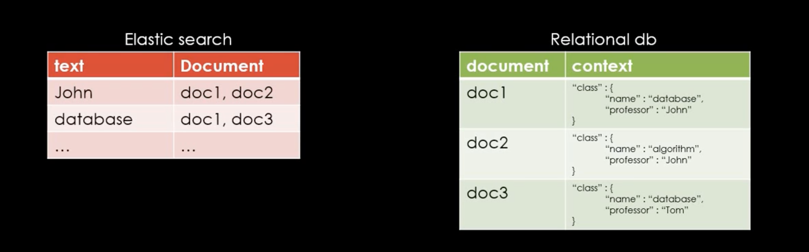
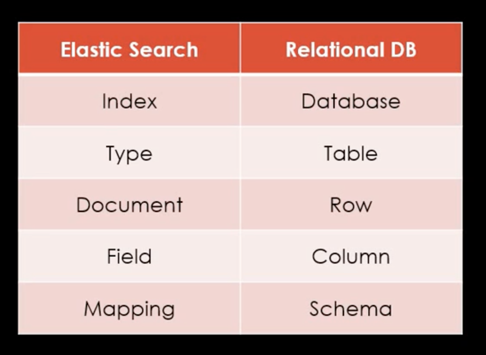
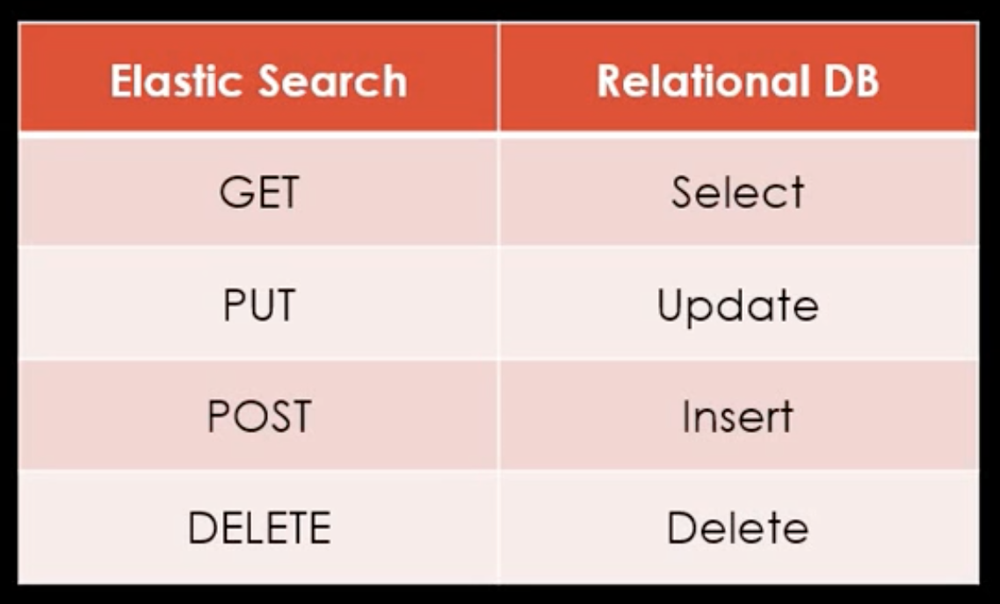
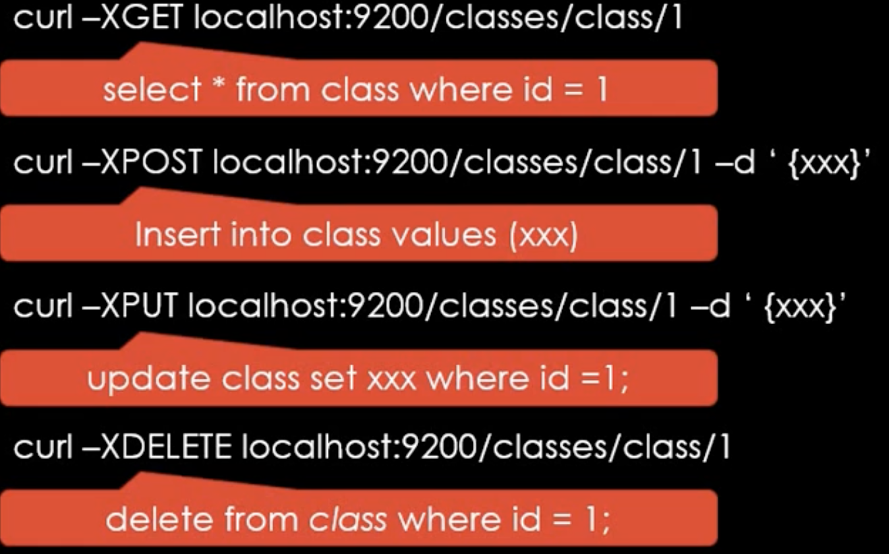

#ElasticSearch란?
데이터를 수집하여 데이터를 인덱싱하여 저장하는 DB
# 저장하는 방법
아래와 같이 해쉬테이블 처럼 저장을한다.  
John이란 텍스트를 가진 데이터는 doc1,doc2에 있으며 database를 갖고있는 데이터는 doc1,doc3에 있을것이다.  

# 용어정리

# RDBMS와 틀린 데이터 처리방법



#엘라스틱 테스트
##GET
데이터를 Select해온다 
1. curl -XGET http://localhost:9200
```json
{
  "name" : "soorageniusui-MacBookPro.local",
  "cluster_name" : "elasticsearch_sooragenius",
  "cluster_uuid" : "6m8gNdwXT9e_idNxGxaPQw",
  "version" : {
    "number" : "7.5.1",
    "build_flavor" : "default",
    "build_type" : "tar",
    "build_hash" : "3ae9ac9a93c95bd0cdc054951cf95d88e1e18d96",
    "build_date" : "2019-12-16T22:57:37.835892Z",
    "build_snapshot" : false,
    "lucene_version" : "8.3.0",
    "minimum_wire_compatibility_version" : "6.8.0",
    "minimum_index_compatibility_version" : "6.0.0-beta1"
  },
  "tagline" : "You Know, for Search"
}
```
2. curl -XGET http://localhost:9200/classes?pretty
classes라는 Index(DataBase)에 Search를 한다 
```json
{
  "error" : {
    "root_cause" : [
      {
        "type" : "index_not_found_exception",
        "reason" : "no such index [classes]",
        "resource.type" : "index_or_alias",
        "resource.id" : "classes",
        "index_uuid" : "_na_",
        "index" : "classes"
      }
    ],
    "type" : "index_not_found_exception",
    "reason" : "no such index [classes]",
    "resource.type" : "index_or_alias",
    "resource.id" : "classes",
    "index_uuid" : "_na_",
    "index" : "classes"
  },
  "status" : 404
}
```
##PUT
1. curl -XPUT http://localhost:9200/classes\?pretty
classes라는 Index를 생성한다
```json
{
  "acknowledged" : true,
  "shards_acknowledged" : true,
  "index" : "classes"
}
```
- 제대로 생성됬는지 확인하기 ( curl -XGET http://localhost:9200/classes?pretty )
```json
{
  "classes" : {
    "aliases" : { },
    "mappings" : { },
    "settings" : {
      "index" : {
        "creation_date" : "1577080525341",
        "number_of_shards" : "1",
        "number_of_replicas" : "1",
        "uuid" : "jDpqwAcOT2GugDOJTMPXyQ",
        "version" : {
          "created" : "7050199"
        },
        "provided_name" : "classes"
      }
    }
  }
}
```
##DELETE
1. curl -XDELETE http://localhost:9200/classes\?pretty
classes라는 Index를 삭제한다

```json
{
  "acknowledged" : true
}
```
- 제대로 삭제되었는지 확인하기 ( curl -XGET http://localhost:9200/classes?pretty )
```json
{
  "error" : {
    "root_cause" : [
      {
        "type" : "index_not_found_exception",
        "reason" : "no such index [classes]",
        "resource.type" : "index_or_alias",
        "resource.id" : "classes",
        "index_uuid" : "_na_",
        "index" : "classes"
      }
    ],
    "type" : "index_not_found_exception",
    "reason" : "no such index [classes]",
    "resource.type" : "index_or_alias",
    "resource.id" : "classes",
    "index_uuid" : "_na_",
    "index" : "classes"
  },
  "status" : 404
}
```
##POST
1. curl -XPOST http://localhost:9200/classes/class/1/ -d '{"title" : "Algorithm", "professor" :"John"}' -H 'Content-Type: application/json'
데이터를 추가한다
classes라는 Index(DataBase)밑에 class(Table)라는 타입으로 PK는 1로 생성한다.
```json
{
  "_index" : "classes",
  "_type" : "class",
  "_id" : "1",
  "_version" : 1,
  "result" : "created",
  "_shards" : {
    "total" : 2,
    "successful" : 1,
    "failed" : 0
  },
  "_seq_no" : 3,
  "_primary_term" : 1
}
```
#bulk 테스트
BulkAPI를 통하여서 Insert,Update,Delete를 다량으로 한번에 진행할 수 있다.
1. curl -XPOST http://localhost:9200/_bulk?pretty --data-binary @./Query/bulk_class.json -H 'Content-Type: application/json'
#Mapping 이란?
관계형 데이터 베이스의 스키마와 같다.  
맵핑없이 데이타를 넣으면 위험하다.  
날짜 데이터인데 날짜인지 모르면은 String으로 파악하기에 위험하다.  
```json
{
	"class" : {
		"properties" : {
			"title" : {
				"type" : "text"
			},
			"professor" : {
				"type" : "text"
			},
			"major" : {
				"type" : "text"
			},
			"semester" : {
				"type" : "text"
			},
			"student_count" : {
				"type" : "integer"
			},
			"unit" : {
				"type" : "integer"
			},
			"rating" : {
				"type" : "integer"
			},
			"submit_date" : {
				"type" : "date",
				"format" : "yyyy-MM-dd"
			},
			"school_location" : {
				"type" : "geo_point"
			}
		}
	}
}
```
1. curl -XPUT 'http://localhost:9200/classes/class/_mapping?include_type_name=true&pretty' -d @Query/mapping.json -H 'Content-Type: application/json'
- elastic 7버전 이상부터는 include_type_name을 정확히 명시해야한다
- String이 사라지고 text로 변했다고한다.
-  curl -XGET http://localhost:9200/classes/\?pretty
```json
{
  "classes" : {
    "aliases" : { },
    "mappings" : {
      "properties" : {
        "major" : {
          "type" : "text"
        },
        "professor" : {
          "type" : "text"
        },
        "rating" : {
          "type" : "integer"
        },
        "school_location" : {
          "type" : "geo_point"
        },
        "semester" : {
          "type" : "text"
        },
        "student_count" : {
          "type" : "integer"
        },
        "submit_date" : {
          "type" : "date",
          "format" : "yyyy-MM-dd"
        },
        "title" : {
          "type" : "text"
        },
        "unit" : {
          "type" : "integer"
        }
      }
    },
    "settings" : {
      "index" : {
        "creation_date" : "1577082171932",
        "number_of_shards" : "1",
        "number_of_replicas" : "1",
        "uuid" : "kWB_YyXATMOFYg3tSyup9w",
        "version" : {
          "created" : "7050199"
        },
        "provided_name" : "classes"
      }
    }
  }
}
```